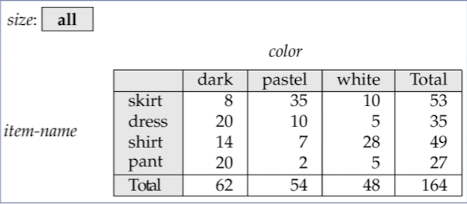
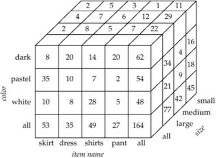
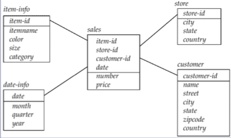
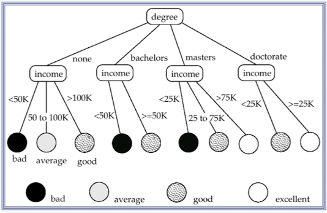
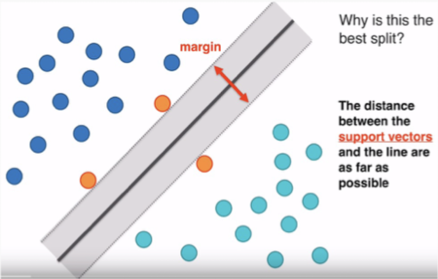
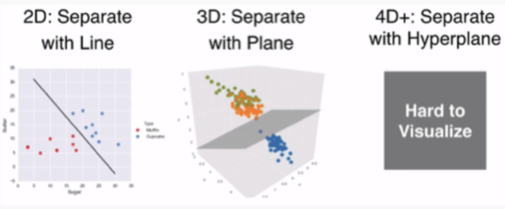
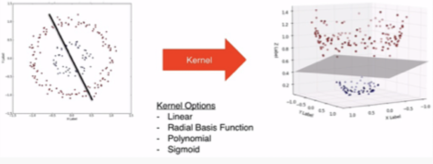
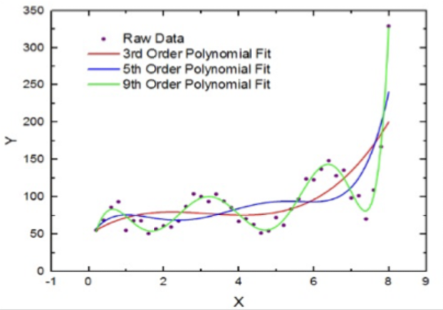

# 11. Data Analytics

## Decision Support Systems
1. Data Analysis
1. Statistical Analysis
1. Data Mining
1. Data Warehouse

## Online Analytical Processing (OLAP)
Interactive analysis, different views/summaries of data

### Multi-dimensional Data
Data that can be modeled as dimension and measure attributes.
* **Measure attributes**: Measure some value
* **Dimension attributes**: Dimensions on which the measure attribs are viewed

#### Cross Tabulation (Pivot Table)

* **row/column headers**: Dimension attributes form 
    * Rest of the dimension attributes listed at the top
* **cell value**: Aggregates of dimension attributes

#### Data Cube
Multidimensional($n$) generalization of a cross-tab

### Types of OLAP
1. **Pivoting**: Change dimesions of cross-tab
1. **Slicing** (dicing): cross-tab for fixed-values only
1. **Rollup**: Finer → coarser granularity data
1. **Drill down**: Coarser → finer granularity data

## Data Warehousing
A **data warehouse** is a repository of information gathered from multiple sources, stored under a *unified* schema, at a *single* site. Data sources often only store *current* data, while warehouses provides unified view of all data, including *historical* data.

### Design Issues
#### When/How to gather data
* **Source-Driven Architecture**: Data sources transmit data (continuous or periodic)
* **Destination-Driven Architecture**: Warehouses request data (periodic)
* Syncing source/destination expensive
#### What schema to use
* Schema integration

#### Data cleansing
* Mistakes: **Merge** from multiple sources and **purge** duplicates

#### Propagating Updates
* Warehouse may be materialized view of data source schema

#### What to summarize
* Raw data: too large → Aggregated data is enough
* Queries on raw data can often be transformed by query optimizer to use aggregate values

### Star Schemas
* Encoded using small integers, mapped to full values via **dimension tables**

## Data Mining
**Data mining** is the process of semi-automatically analyzing large databases to find useful **patterns**.

### Prediction
Make a prediction based on past values
1. **Classification:** Predict class of new item
1. **Regression Formulae:** Predict function result from a set of mappings of unknown function

### Descriptive Patterns
1. **Associations** *(e.g. books bought by similar customers)*
1. **Clusters** *(e.g. sickness clustered around contamination point)*

---

## Classification

### Decision Tree
Classification rules can be shown as a **decision tree**

#### Construction of Decision Trees
* **Training Set**: Data with known classes
* Greedy, top-down generation of decision trees
    * Internal node: Partitions the data into groups based on...
        * Partiioning attribute
        * Paritioning column
    * Leaf node: Either...
        * Data items are of the same class
        * No further classification possible

### Best Splits
Pick best attributes and conditions to partition.

Set **purity**: measured from **Gini**, **Entropy**,...

$$ Impurity(S_1, S_2, ... S_r) = \sum_{i=1}^r {|S_i| \over |S|}Info(S_i) $$
$$ Info(S_i) = - \sum_{j=1}^mp_jlog_2p_j $$

Information gain (IG) due to split:

$$ IG(S, \{S_1, S_2, ..., S_r\}) = Info(S) - Impurity(S_1, S_2, ..., S_r) $$

### Bayesian Classifiers
Bayes' Theorem:

$$ P(c_j \mid x) = { P(x \mid c_j) P(c_j) \over P(x) } $$

Naïve Bayesian Classifiers:

$$ P(x \mid c_j) = P(x_1, ..., x_n \mid c_j) = \prod_{i=1}^nP(x_i \mid c_j) $$

### Support Vector Machine Classifiers

#### Higher Dimensions: Visual

### Kernel Trick: Visual

### Neural Network Classifiers
Input → Hidden → Output

## Regression
Find coefficient that gives the best possible **fit**
* Linear regression
* Curve fitting

Fit may be inaccurate because:
* Noise
* Relationship not polynomial

## Association

### Rules
*Antecedent* → *Consequent*

### Support
What fraction satisfies both antecedent and consequent?

$$Support(X \Rightarrow Y) = {Frequencey(X, Y) \over N}$$

### Confidence
How often is the consequent true when the antecedent is true?

$$Confidence(X \Rightarrow Y) = {Frequency(X, Y) \over Frequency(X)}$$

## Clustering
Find clusters in points so that similar points lie in same cluster
* Group points so that the average distance of points from the centroid is minimized
* Minimize average distance between every pair of points in cluster

### Hierarchial Clustering
* agglomerative clustering: start small, cluster clusters
* divisive clustering algorithms: start with one large cluster, refine (break) clusters

## Other types of Mining

### Text Mining

### Data Visualization